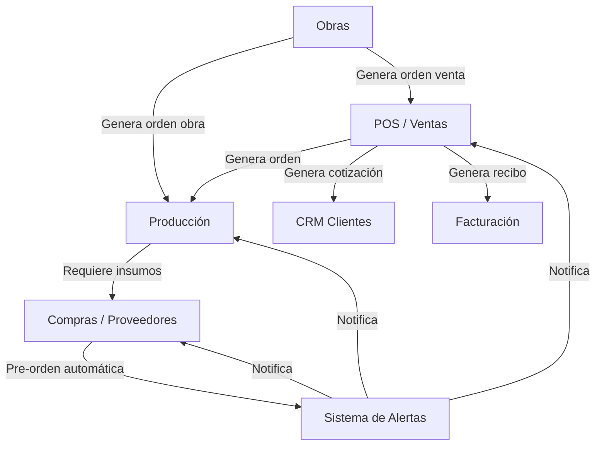

# Chisa ERP — Mejoras para Producción y Presentación al Cliente

> **Contexto:** Los módulos de "Reloj Checador", "Recursos Humanos" y "Administración" ya funcionan en producción. El resto del sistema requiere mejoras sustanciales para presentarse al cliente y lanzar a producción.

---

## Prioridades Inmediatas (Alta Urgencia)

| Prioridad | Módulo | Estado Actual |
|-----------|--------|---------------|
| 🔴 Crítica | CRM / Ventas / POS | Requiere overhaul completo |
| 🔴 Crítica | Proveedores / Compras | Requiere mejoras profundas |
| 🟡 Alta | Producción | Requiere afinación de cálculos y entrenamiento |
| 🟡 Alta | Obras | Requiere integración ventas-producción |
| 🟢 Media | Sistema de Alertas | Mejora menor de UX |
| 🟢 Media | Facturación | Pendiente (posterior) |

---

## 1. 🔴 Módulo de CRM / Ventas / POS (`/ventas/`)

### 1.1 POS Profesional
- [ ] Rediseñar el POS para que sea profesional y serio, con:
  - Catálogo de productos con descripciones a detalle (modal de producto)
  - Adaptado a la lista actual de productos (mejorada en iteración previa)
  - Acceso a histórico de ventas con detalles de productos
  - Opción de crear **cotizaciones** con notas internas
- [ ] Verificar estatus de órdenes de venta ya existentes en el sistema

### 1.2 Recibos / Notas de Remisión
- [x] Generar recibo con datos de la empresa al crear la venta
- [x] Revisar otras secciones (ej. órdenes de compra en proveedores) que ya generan recibos profesionales con logotipo como referencia
- [x] Crear **3 templates de recibos** para que vendedores seleccionen diseño:
  - Diseño 1: Formato simple/factura
  - Diseño 2: Nota de remisión con desglose
  - Diseño 3: Formato personalizado
- [x] Logotipo global configurado (usar el mismo de configuración global)
- [ ] El POS debe permitir: **ventas directas** y **cotizaciones** (administrables desde CRM)

### 1.3 Integración con otros módulos
- [ ] Ventas ya se conectan con facturación (verificar, ajustar después)
- [ ] Ventas debe conectarse con **producción** para generar órdenes de fabricación

### 1.4 CRM de Clientes (`ventas/Clientes`)
- [x] Mejora profunda del CRM de clientes:
  - Mejorar funcionalidades existentes
  - Agregar nuevas funcionalidades para competir con CRM profesionales
  - [x] Historial de compras por cliente
  - [x] Seguimiento de cotizaciones (con conversión a orden de venta)
  - Gestión de contacto y dirección

---

## 2. 🔴 Módulo de Proveedores / Compras

### 2.1 Categorías e Insumos
- [ ] Mejorar drásticamente sección de categorías
- [ ] Verificar enlace correcto entre categorías e insumos de proveedores

### 2.2 Pre-órdenes de Compra Automáticas
- [x] Cuando un insumo requerido en producción esté faltante:
  - [x] Crear **pre-orden de compra** automática — backend + UI en simulador de producción (`produccion/productos/main.php`, `produccion_productos.js`)
  - [x] Requerir autorización de administrador con acceso a proveedores — backend + UI en Compras (`compras/ordenes_compra/main.php`, permiso `compras_autorizar_preordenes`)
  - [x] Activar alerta en el sistema de alertas (ya existe) — agregado bloque en `Notifications.php`
  - [x] Conversión segura de unidades de medida (Kg/L/Pza vs. Cubeta/Tambo/Galón/etc.) antes de comparar contra stock — `unidades_helper.php`

### 2.3 CRM de Proveedores (`/compras/Proveedores`)
- [x] Mejorar CRM de proveedores:
  - Agregar funcionalidades faltantes
  - Mejorar las existentes (historial de órdenes de compra paginado)
  - Diseño profesional (offcanvas con tabs: Información / Insumos / Órdenes)

### 2.4 Órdenes de Compra
- [ ] Mejorar proceso de órdenes de compra:
  - **Manual**: desde módulo `compras/OrdenesCompra`
  - **Automática**: pre-órdenes desde producción, obras o cotizaciones
- [ ] Algunos productos de proveedores tienen:
  - Nombre original del producto
  - "Etiqueta" usada por trabajadores de producción (campo adicional)

---

## 3. 🟡 Módulo de Producción

### 3.1 Entrenamiento de Formulaciones (Modelo: Sonnet — alta precisión)
- [ ] El sistema ya carga archivos Excel (`BASES ORGANICAS Y TINTAS`, `CHISA GLASS 2021`, `FICHAS_CHISA_GLASS_2014`)
- [ ] **Cargar archivo principal** actual de producción (`archivo_principal_entrenamiento.xls`) + otros en carpeta `entrenamiento/`:
  - `FICHAS DE PINTURA Y PASTA.xlsx` — fichas técnicas de pintura y pasta
  - `PASTA SERGIO.xlsx` — formulaciones de pasta (línea Sergio)
  - `ficha masa roca.xlsx` — ficha técnica de masa roca
  - `T034.xls` — formulación técnica T034
  - `archivo_principal_entrenamiento.xls` — archivo principal de entrenamiento
- [ ] Verificar productos existentes
- [ ] Afinar cálculo de formulaciones
- [ ] Cargar fórmulas y muestras faltantes
- [ ] Detectar repetidos → verificar variaciones → agregar al **árbol de cambios de formulaciones**
- [ ] Agregar nombre de la pestaña de Excel como **nota de formulación**

### 3.2 Cálculo de Insumos (Modelo: Sonnet — alta precisión)
- [ ] Verificar cálculo de insumos:
  - Al recibir pedido que requiere insumo X
  - Calcular cuánto resta de ese insumo (kilos, litros, porcentaje)
  - Si no alcanza → **alerta en ventas, compras y producción**
- [ ] Corroborar que insumos estén bien calculados, programados y formulados
- [ ] Esto también aplica al módulo **proveedores/insumos**

---

## 4. 🟡 Módulo de Obras

### 4.1 Cálculo de Materiales y Documentación
- [ ] Mejorar cálculo de materiales y generación de Obras
- [ ] Generar documentación profesional (ver imágenes de referencia `@resumen1.jpeg`, `@resumen2.jpeg`, `@resumen3.jpeg`, `@resumen4.jpeg`):
  - Datos de la empresa actual
  - Logotipo configurado
  - Posibilidad de descargar o visualizar en PDF

### 4.2 Vinculación Obra ↔ Venta ↔ Producción
- [ ] La obra genera:
  - **Orden de obra nueva**
  - **Orden de venta** (CRM)
- [ ] Son 2 entidades separadas pero deben estar **enlazadas**
- [ ] La obra es quien vincula orden de obra con orden de venta de productos

### 4.3 Notificaciones a Producción
- [ ] Al generar orden → notificación a producción (verificar que funcione)
- [ ] Agregar **alerta sonora** para nuevas órdenes

---

## 5. 🟢 Sistema de Alertas (No urgente)

### 5.1 Notificaciones Toast
- [ ] Cuando haya una nueva alerta:
  - Mostrar mensaje temporal al usuario
  - Que desaparezca tras unos segundos
  - Sin necesidad de abrir el botón de alertas
  - Estilo "toast notification" (moderno, no intrusivo)

---

## Integración General (Requerida)

---

## Referencias Técnicas

| Documento | Propósito |
|-----------|-----------|
| `PLAN_MEJORA.md` | Plan maestro de mejora del ERP (512 líneas, priorizado por fases) |
| `PLAN_DE_IMPLEMENTACION.md` | Plan detallado de implementación del módulo de Producción/Formulaciones |
| `imagenes_referencias/` | Imágenes de referencia para formulaciones y documentación de obras |
| `@resumen1.jpeg` a `@resumen5.jpeg` | Ejemplos de documentación profesional de obras (PDF) |
| `image.png` a `image-8.png` | Ejemplos de formulaciones en Excel (formato de producción) |
| `DOCUMENTACION_TECNICA.md` | Documentación técnica del sistema |
| `PRUEBAS_Y_SEGUIMIENTO.md` | Pruebas y seguimiento |
| `SISTEMA_ALERTAS_NOTIFICACIONES.md` | Documentación del sistema de alertas |

---

## Checklist de Revisión Final para Producción

- [ ] Módulo Ventas/POS — Funcionalidad completa y probada
- [x] Recibos profesionales con 3 templates seleccionables
- [x] CRM Clientes — Mejorado a nivel profesional
- [x] CRM Proveedores — Mejorado a nivel profesional
- [x] Pre-órdenes automáticas desde producción
- [ ] Cálculo de insumos — Preciso y con alertas
- [ ] Formulaciones — Entrenadas con datos reales
- [x] Módulo Obras — Documentación PDF profesional (5 hojas detalladas)
- [x] Integración Obra ↔ Venta ↔ Producción funcional
- [x] Notificaciones sonoras para nuevas órdenes
- [x] Alertas toast (no intrusivas) implementadas
