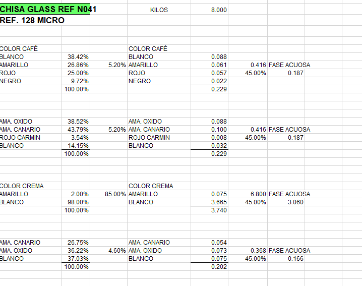
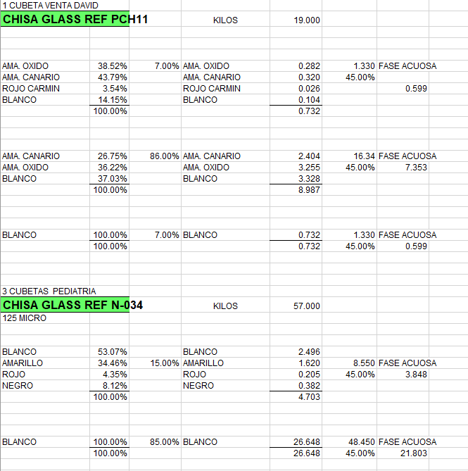
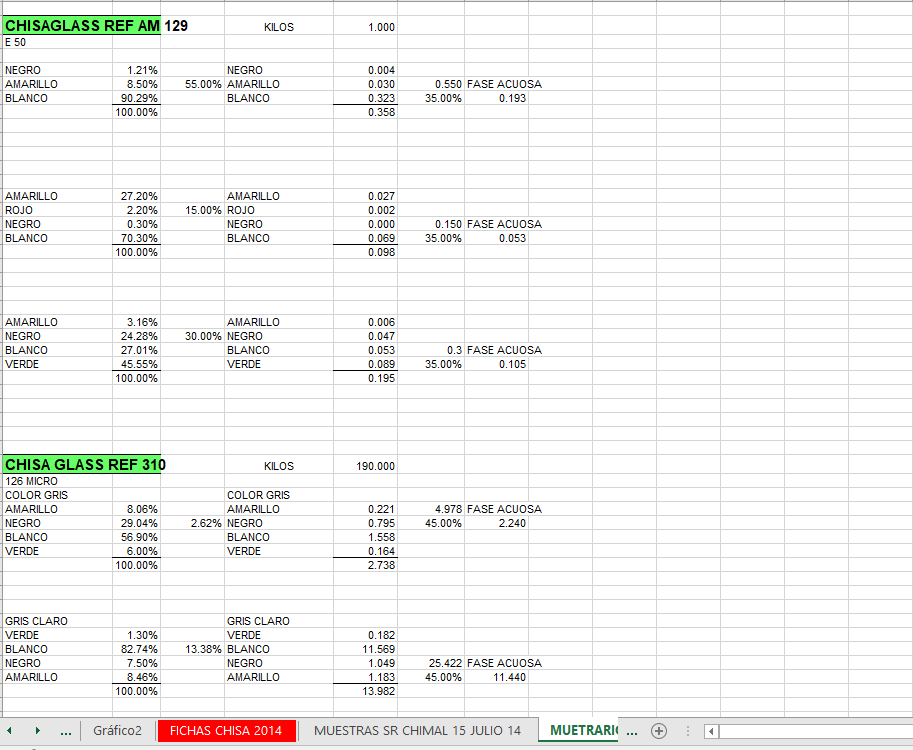
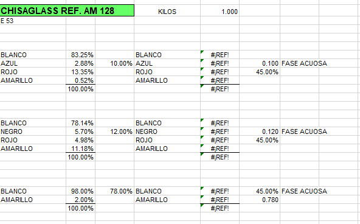
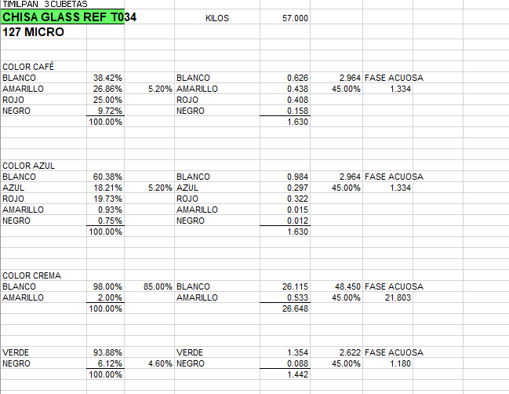
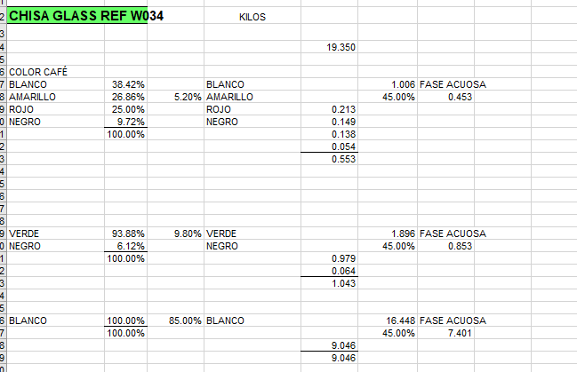
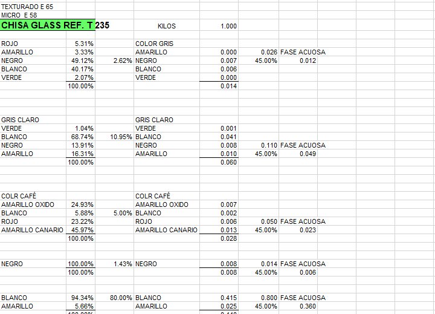
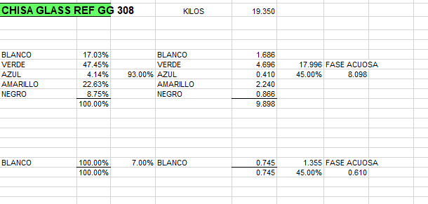
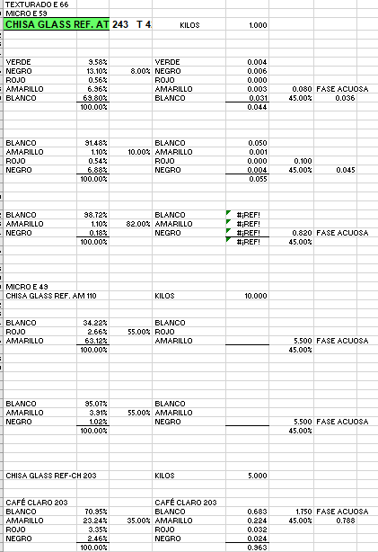

# Workflow de producción. Crítico.

1.- Se realiza una venta desde "POS" o una nueva obra desde el "módulo de obras". En ambos casos se genera una orden de venta y un pedido del sistema con los productos(la cual es la que lleva el estatus, por lo que es necesario verificar que estas ordenes ya tengan un estatus en la base de datos).

2.- Se verifica si tenemos los productos(stock suficiente) para surtir la orden de venta o de la obra.

 -En caso de SI tenerlo: En el dashboard de producción se debe mostrar el pedido(obra o venta) para empezar a surtirlo así como una alerta para que sea vista por los usuarios de producción(se pueden crear alertas sonoras en tiempo real), se debe actualizar la orden de venta o de la obra con el estatus "En Preparación" y al momento de entregar los productos se deberá leer el código de barras de las cubetas o productos(el cual se debe generar en producción al fabricar los productos) para confirmar que se han surtido(en este punto los productos o cubetas salen del almacén y la orden se actualiza con el estatus  "Entregado" para ventas directas o "Enviado" para obras u ordenes que requieran un envío) los productos o cubetas si están a la espera de ser surtidos o enviados(posteriormente se contectara con un API de envíos de la empresa TRES GUERRAS). Aquí finaliza el proceso en almacén (el proceso puede continuar en POS, facturación o contabilidad dependiendo la necesidad de la orden de venta u obra).
 
 -En caso NO tenerlo: En el dashboard de producción se debe mostrar el pedido(obra o venta) para que los usuarios del área de producción puedan comenzar su fabricación o producción, agregando el nuevo pedido en los cards (ya existentes) del dashboard de producción, y con una alerta para que sea vista por los usuarios del área de producción(se pueden crear alertas sonoras en tiempo real). Se continua al punto 3.

**Importante**: 
    - Es necesario que el sistema haga un calculo aproximado de que insumos o materia prima se necesitan para la orden de venta u obra(es decir, de los productos que se tienen que fabricar), pero los usuarios del área de producción y proveedores pueden modificar o ajustar la cantidad de insumos o materia prima que necesitan y en caso de requerir insumos, se genere la orden de compra(preorden) para el modulo de compras/proveedores.

    - Es necesario ajustar muy bien como se calculan los insumos o materia prima para los pedidos de obras y ordenes de venta, por lo cual es necesario realizar un pre-entramiento del sistema(posteriormente se ajustara con el uso real), para lo cual, he creado la carpeta "imagenes_referencias" de imagenes con formulaciones reales en las cuales aparecen 3 columnas:
      -1a) El título o nombre del producto final(el cual debe aparecer en la tabla de productos): En la primera fila aparece el nombre del producto final y algún código de identificación. En las filas posteriores de esta primera columna aparecen el nombre de los insumos o materia prima.(EJ. de la imagen de referencia CHISAPLUS.jpg el primer insumo es agua, seguido de edenol doa, dipersante, etc)
      -2a) En la segunda columna, en la primera fila viene la cantidad en unidades del producto final(Ejemplo: Kilos por cubeta en CHISAPLUS.JPG). En las siguientes filas de la segunda columna, vienen los porcentajes de cada insumo o materia prima y al final el 100% indicando el total de los porcentajes.
      -3a) En la tercera columna, en la primera fila viene la cantidad  final del producto( Ejemplo: 27 Kilos por cubeta en  CHISAPLUS.JPG). En las siguientes filas de la tercera columna, vienen las unidades de medida de cada insumo o materia prima en kilos, litros, etc con el total al final(27 Kilos en el ejemplo de CHISAPLUS.JPG).

    - Es necesario que el sistema permita visualizar una tabla similar a las de las imagenes de referencia, en la cual se muestren los productos de la venta o la obra y sus formulaciones, así como los insumos o materia prima necesarios para su producción y que al final por ejemplo, esta formulación es de una cubeta de 27 kilas y la obra o la orden de venta son 3 cubetas de 27 kilos cada una, el sistema debe calcular la cantidad de insumos o materia prima necesarios para las 3 cubetas.

    La idea es que el equipo de producción tenga el dashboard actual y una pestaña de consulta con tablas similares a las siguientes (como si fuera una consulta en excel), ademas que se tenga un formulario sencillo de editar (solo usuarios con permiso de edicion, ) para ajustar formulaciones y que se tenga un boton de actualizar o generar nueva formulación para que se guarde en el historial. El sistema actual permite algo asi, pero es confuso de usar, y requiere mejorar mucho esta funcionalidad, por lo que adjunto las imagenes de referencia para que te des una idea de lo que se requiere. Ademas, estas formulaciones son las que se editan y se genera un nuevo codigo dependiendo de las especificaciones del cliente, por lo que se deben poder consultar por comentarios, fechas, cliente, etc.  Importante: estas formulaciones son reales, por lo que debes considerar que seran usadas para que el sistema sea llenado y entrenado (paso posterior, por lo que necesito tomar en cuenta que se cargara un formato de excel que permita esto), pero ademas, el sistema debe permitir calcular que esa formula es para tantos "kilos", y tantos kilos permiten "x" metros cuadrados -> proyecto "y" requiere "x" metros cuadrados de tal material, por lo que el sistema calcula la cantidad de insumos o materia prima necesarios para el proyecto. ¿me explico?
    
    ** Imagenes de referencia de formulaciones:
    
    
    
    
    
    
    
    
    
    

    - El sistema en este punto  permite consultar estas formulaciones y ajustar las cantidades de insumos o materia prima necesarios para la producción. 

    - También en este punto es necesario que los usarios de producción tengan acceso al historial de formulaciones por cliente, ya que en ocasiones los clientes solicitan formulaciones específicas que se deben mantener en el historico, algomo similar a un arbol o linea de tiempo(es posible que esto ya exista en el sistema actual pero se debe mejorar y ajustar mucho en esta iteración).

3.- Se verifica de manera automática que existan los insumos o materia prima para el pedido de la venta o la obra pendiente

 - En caso de NO contar con los insumos: De no existir o faltar materia prima o insumos, se genera una solicitud de orden de compra(preorden), la cual debe llegar al área de "proveedores" para su adquisición. De igual manera, los usuarios del área de producción pueden agregar insumos o materia prima a la preorden, la cual se enviará al módulo de proveedores una ves finalizada la edición (Verificar que los usuarios con acceso al área de compras/proveedores, reciban estas alertas y que se habilite en una sección de "compras/proveedores" un listado con todas las pre-ordenes para que puedan ser validadas por usuarios con permisos de compras/proveedores y convertirlas a ordenes de compra). Una vez que se reciban todos los insumos del proveedor, se puede actualizar la orden de compra y la orden en producción para continuar con la fabricación(revisar como catalogar la materia prima recibida por el proveedor, puede ser por el "qr" o "codigo de barras" que los proveedores  mandan y que también en producción, puedan actualizar de manera manual la llegada de este insumo lo cual es necesario para actualziar el stock de insumos o materia prima y continuar con la fabricación y suirtido de ventas u obras). Se deben mostrar alertas a los usuarios con permisos al área de proveedores, producción, almacén y administración con las nuevas preordenes. Estas pueden estar en las notificaciones del sistema y en el dashboard de inicio para los usuarios que tengan permisos al área de proveedores, producción, almacén y administración. La preorden se podrá convertir en orden de compra desde el área de proveedores. 

 - En caso de Si contar con los insumos: Se puede continuar con la fabricación de los productos, al momento de la fabricación, los usuarios realizaran el pesaje de los insumos o materia prima necesarios para la producción y se actualizara el stock de insumos o materia prima(se descuentan los kilos, litros o cubetas).

 4.- Al finalizar la prodducción de los productos, el sistema deberá generar un código de barrras para todos los productos(cubetas generalmete) los cuales se podrán imprimir y pegar. En caso de requerir la lectura de los códigos de barras para la salida de productos, se podrá hacer desde el módulo de ventas o desde el módulo de almacén dando seguimiento a la salida de esa orden de venta u obra.

 

# Notas importantes y faltantes

 - [] En produccion/Productos, es necesario mejorar, optimizar y refactorizar el sistema de variantes(productos con formulaciones similares pero variantes de color), así como el árbol de formulaciones e historial. Lo que se busca con el árbol(historíco) es que si algún cliente en específico tiene algun requerimiento especial en la formulación de algún producto, se pueda consultar el historial y replicar la formulación exacta para ese cliente en específico.

